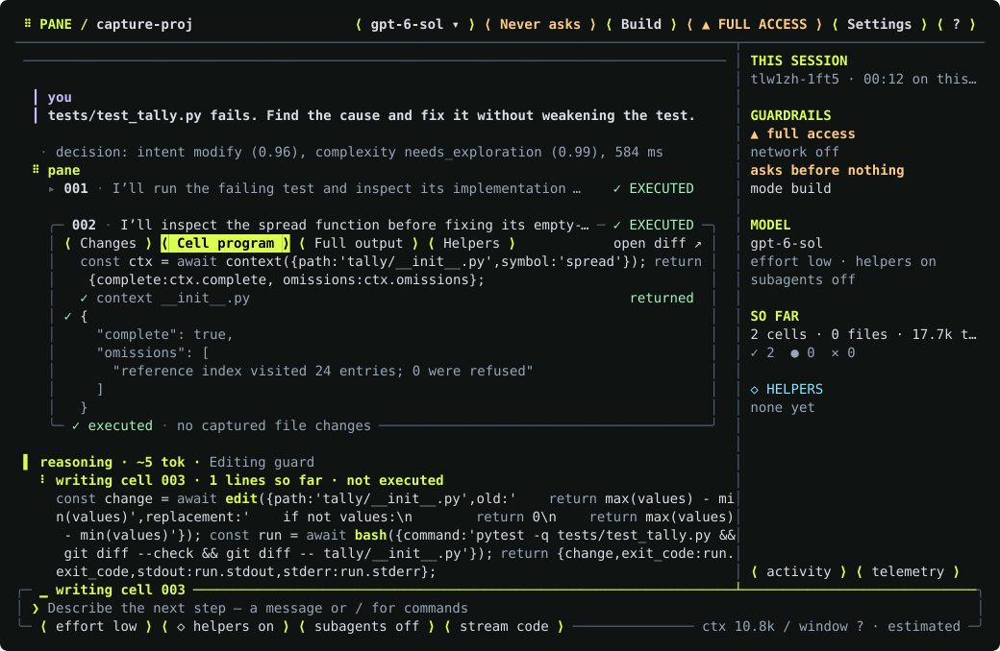
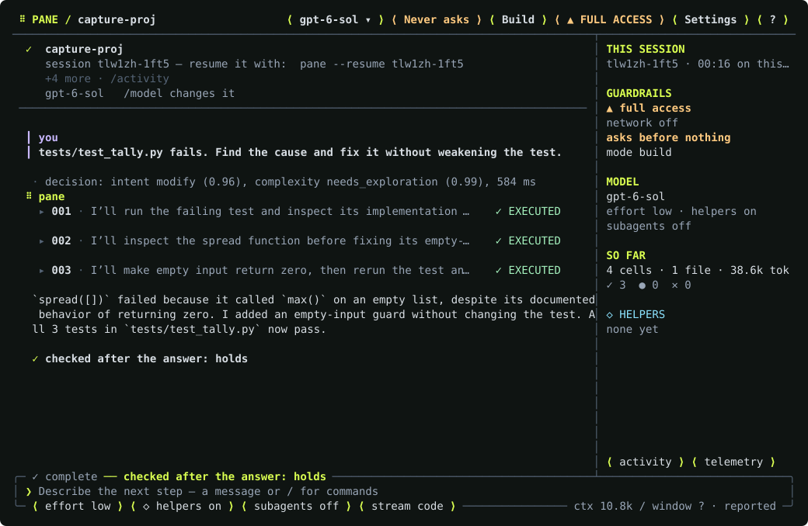

# Pane

**A coding agent for your terminal whose tool results never become text in the
conversation.** You give it a task in a project; it works the task in turns,
the way Claude Code or Codex does. What differs is where the work lives: every
result stays a named object in a runtime the model addresses from code, so a
large grep costs a preview and a handle, not its bytes on every later turn.



<sub>Captured 2026-09-24 from a live session (gpt-6-sol, a scratch project with one failing test), rendered from the terminal's own screen.</sub>

## At a glance

Measured 2026-09-24 against the Codex CLI on four tasks, same model (GPT-6
Sol), three attempts each — [measurements](docs/product/pane/helper-measurements.md#9-pane-vs-codex-and-a-command-that-yields-2026-09-24-gpt-6-sol-n--3):

| | Pane | Codex |
|---|---|---|
| Tasks passed | 12 of 12 | 12 of 12 |
| Facts found on the explore task, of 8 | 8.0 | 7.3 |
| Tokens, cached included | 1.98M | 2.41M |
| Uncached tokens | 214k | 212k |
| Model time, all twelve attempts | 975 s | 976 s |
| Ran the repository's required gate script on an edit | 4 of 6 | 1 of 6 |
| Time for all four tasks | 473 s | 369 s — Codex is 1.28× faster |
| … without that gate script | 406 s | 369 s — Codex is 1.10× faster |

- 81–91 % of each task's input came from the provider's prompt cache (from
  the uncached figures in the [same measurements](docs/product/pane/helper-measurements.md#9-pane-vs-codex-and-a-command-that-yields-2026-09-24-gpt-6-sol-n--3)).
- 209 tokens show the model 275 KB of grep output; a
  [test](crates/pane/tests/handles.rs#L260) on every commit fails above 300.

Pane is in public pre-release on macOS and Linux. Windows builds exist; the
Windows installer does not yet.

## Install

```sh
curl -fsSL https://harzerheribert.github.io/glasshouse/install.sh | sh -s -- --pane-only
```

The installer verifies the release archive against its `SHA256SUMS`, unpacks
it into `~/.local/lib/glasshouse/versions/<tag>` and links `pane` and
`inference-gateway` into `~/.local/bin`. It installs no other harness, touches
no credential and edits no shell profile. Drop `--pane-only` to link
`glasshouse` too. A release install checks for a newer release at most once a
day and says so; `pane update` installs one on demand.

## Start

```sh
cd your-project
pane
```

That opens the terminal UI in the current project. The first time, Pane says
no credential is stored yet: type `/login` to connect a **Claude or ChatGPT
subscription** in the browser, or `/key anthropic` (or `openai`, …) to store an
API key. `/models` chooses which model answers and at what effort.

```sh
pane -p "fix the failing test in crates/foo"   # one task, non-interactive
pane --continue                              # pick up the last session
pane --resume [id] | pane --sessions         # an earlier one
pane doctor                                  # what Pane found and what is missing
```

Pane reads what your project already has, unedited: `CLAUDE.md` and
`AGENTS.md` (root, nested and your global one), `.claude/settings.json`
permissions and hooks, `.claude/commands`, skills, and the MCP servers
`.mcp.json` names.

## What makes it different

> A tool result never becomes text in the conversation.

By default the model sees one tool: a **cell**, a TypeScript program run in an
embedded V8 isolate. Inside it `read`, `grep`, `edit`, `bash`, `web.fetch` and
the rest are functions, and what they return stays in the isolate as a named
handle. The model gets a bounded preview and acts on the handle in the next
cell. A test that runs on every commit greps a fixture and holds the result
**under 300 tokens: 275,020 bytes of grep output render as 209 today**, and
the handle is still filterable afterwards.

What follows from that:

- **Edits are code.** The model already holds the file as an object, so an
  edit is `text.replace(a, b)` and one `write`, in the same cell that checked
  it.
- **Running out of context is survivable.** When the conversation stops
  fitting it is compacted into a checkpoint **while the isolate keeps
  running** — a grep from turn three is still addressable afterwards.
- **The prompt cache holds.** History is append-only except at compaction, the
  system prompt does not change between tasks, and the model's own reasoning is
  kept and sent back. On a live fix task the main model read **90 %** of its
  input from cache (2026-09-24).
- **You see the model think.** A reasoning line shows its size and newest
  sentence as it streams, and a cheaper supervisor model watches for loops.
- **It runs in a sandbox.** Commands run under the OS's own confinement —
  Seatbelt on macOS, Landlock and seccomp on Linux, AppContainer on Windows —
  with project containment and never-grantable paths such as `~/.ssh`.
  `--ask-approval` shows each write or edit before it runs.



<sub>The same session, answered: three cells, the fix, and the check that ran behind the answer. Captured 2026-09-24.</sub>

It also has what you would expect: plan mode, subagents and custom agents,
background jobs, a to-do list, web search and fetch, image input, rollback of
the agent's changes, and resume.

## Measured against Codex

Same four tasks, same model (GPT-6 Sol), three attempts each, 2026-09-24,
Pane at its shipped defaults (6fc97dc7). **Same results and the same model
time. Pane used 18 % fewer tokens overall and as many uncached ones. Codex
finished 1.28× faster, and most of that is verification: this repository's
`CLAUDE.md` asks for its gate script before an edit is reported, and Pane
ran it in 4 of 6 edit attempts, Codex — which read the same file — in 1.
Without the script Codex is 1.10× faster; the rest is Pane's own extra
checks (formatting, more test runs) on the two edit tasks. On the two tasks
with nothing to verify, Pane was as fast or slightly faster.**

| Task | Pane | Codex |
|---|---|---|
| Fix a failing test | 3/3 · 134 s · 452k (49k uncached) | 3/3 · 77 s · 563k (43k) |
| Explore and explain | 3/3 · 71 s · 312k (45k) · 8.0 of 8 facts | 3/3 · 73 s · 398k (68k) · 7.3 of 8 |
| Implement a small feature | 3/3 · 53 s · 124k (23k) | 3/3 · 55 s · 239k (25k) |
| Rename across files | 3/3 · 215 s · 1.09M (97k) | 3/3 · 164 s · 1.21M (76k) |

Passed · mean time from launch to exit, including the task's test run · mean
tokens per attempt, cached included, everything Pane's gateway served (main
model, helpers, the Jev classifier) against Codex's own session logs. Codex
ran in its workspace-write sandbox, Pane with full access. Three attempts per
cell is direction, not proof.

Where the time goes, from each attempt's events: the model worked 975 s in
Pane and 976 s in Codex across all twelve attempts — Pane in fewer, larger
requests (128 against 161), which is also why it reads fewer tokens. The
difference is commands, 422 s against 118 s, and 200 s of that is the gate
script. Handing every long command to a background job automatically was
built and measured: the rename got slower (215 → 253 s) because the model
spent turns collecting its jobs, so it was reverted; a cell can still start
one itself with `bg.run` ([measurements](docs/product/pane/helper-measurements.md#9-pane-vs-codex-and-a-command-that-yields-2026-09-24-gpt-6-sol-n--3)).

An hour earlier the same comparison ran with Pane holding each one-task run
open for its completion check (15–60 s, and it changed no outcome) and at the
provider's default effort: 191 / 137 / 90 / 381 s. Both are now defaults of
the past — the check no longer holds a one-task run, and GPT models run at
low effort unless you choose otherwise.

Earlier measurements, setbacks included: Claude Code beat Pane in both
comparisons of 2026-09-06 and 09-07; on a four-task Terminal-Bench slice Pane
went from 9 of 12 to 12 of 12 (09-12 → 09-13) at about 40 % more tokens; the
full Terminal-Bench suite was paused at 18 of 37. Before 2026-09-24 Pane's GPT
prompt cache was broken, so every earlier GPT token figure overstates its cost.

## Where it stands

**Not yet built:** a way to escalate a command outside the sandbox,
untrusted-repository handling, and IDE integration. An interactive
cross-session picker belongs to Glasshouse, below; Pane keeps `--resume` and
`--sessions`. The full comparison against Claude Code and Codex, row by row,
is [`docs/product/pane/competitive-capability-checklist.md`](docs/product/pane/competitive-capability-checklist.md).

## Accounts and models

Pane talks to models through `inference-gateway`, a local process it starts
when a session needs it and stops with the session. The gateway serves API keys
and signed-in subscriptions (Claude, ChatGPT) and pools several accounts of one
kind. `/login` inside Pane is the usual way in; from the command line:

```sh
inference-gateway subscriptions usage    # each subscription's limits used, and when they reset
inference-gateway subscriptions --help   # connect, logout, pool, verify
```

## Glasshouse (preview)

This repository also holds **Glasshouse**, a control plane for running several
coding harnesses — Pane, Claude Code, Codex — side by side: sessions you can
see and type into, routing across subscriptions and keys, memory a project
keeps across sessions, and warnings when two sessions head for the same file.
It is not yet at Pane's readiness, and Pane does not need it: Pane is one
session and works alone. [`docs/product/architecture.md`](docs/product/architecture.md)
has the three-component picture.

## Build from source

```sh
cargo build --release -p pane -p inference-gateway
cargo build --release                               # glasshouse
scripts/install-local.sh                            # build, install into a new version directory, make it current
scripts/install-local.sh --rollback                 # point `current` at the previous version
```

Each binary is self-contained — no daemon, Node or Python. `pane` embeds V8,
which is why it is not in the workspace's `default-members`.

## How this is developed

Most of the code is written by coding agents under a spec-to-evidence process:
every behaviour change states its contract, lands with a regression test, and
the decisive branch gets a mutation that the test must kill. The process lives
in [`docs/process/agent-sdlc.md`](docs/process/agent-sdlc.md); the Glasshouse
specification is [`docs/product/capability-map.md`](docs/product/capability-map.md),
whose progress follows.

<!-- progress:start -->
## Progress

`█████████████████████████████████████░░░` **1387 closed** · **103 active committed open** (93%)

Separately tracked, and not release-blocking: **0 deferred gate criteria** (Phase 52, Phase 53) awaiting a decision, and **229 parked experimental lines** under Maybe / Experimental.

<details>
<summary>Per-phase breakdown (99 of 123 active phases complete)</summary>

**glasshouse** `█████████████████████████████████████░░░` 757/803

| Phase | Done |
|---|---|
| Phase 1 — Project-root detection and hard isolation | 15/15 ✅ |
| Phase 2B — Agent and tool auto-detection | 16/16 ✅ |
| Phase 2C — First-run onboarding | 19/19 ✅ |
| Phase 2D — Settings foundation | 20/20 ✅ |
| Phase 2 — Persistent project state | 10/10 ✅ |
| Phase 3 — TUI shell | 12/12 ✅ |
| Phase 4 — Generic PTY session runtime | 12/12 ✅ |
| Phase 5 — Native terminal embedding | 8/8 ✅ |
| Phase 6 — Harness adapter interface | 13/13 ✅ |
| Phase 7 — Claude Code adapter | 10/10 ✅ |
| Phase 8 — Codex adapter | 10/10 ✅ |
| Phase 9 — Antigravity adapter | 7/7 ✅ |
| Phase 9A — Harness launch profiles | 26/26 ✅ |
| Phase 9B — Scoped harness wrappers and shims | 9/9 ✅ |
| Phase 9K — Harness-aware response profiles | 29/37 |
| Phase 10 — Unified session model | 14/14 ✅ |
| Phase 10A — Session supervision | 13/13 ✅ |
| Phase 11 — Session overview | 10/10 ✅ |
| Phase 12 — Unified lifecycle event bus | 8/8 ✅ |
| Phase 13 — Direct session messaging | 7/7 ✅ |
| Phase 17 — cmux optional integration | 10/10 ✅ |
| Phase 18 — Raw event recording | 10/10 ✅ |
| Phase 19 — Portable session checkpoints | 14/14 ✅ |
| Phase 20 — Minimal durable project memory | 18/18 ✅ |
| Phase 21 — Memory extraction | 13/13 ✅ |
| Phase 21A — Memory authority classes | 12/12 ✅ |
| Phase 21B — Decision provenance and assumptions | 11/11 ✅ |
| Phase 21C — Validity conditions and invalidation | 11/11 ✅ |
| Phase 21D — Memory age and relevance decay | 9/9 ✅ |
| Phase 21E — Decision ladder and conflict handling | 8/12 |
| Phase 21F — Memory retrieval quality | 10/11 |
| Phase 21G — Memory revalidation | 3/9 |
| Phase 21H — Simplicity-first implementation policy | 10/10 ✅ |
| Phase 21I — Production-aware implementation checks | 11/11 ✅ |
| Phase 21J — Implementation review checklist | 9/9 ✅ |
| Phase 21K — Assumption-aware implementation guardrails | 43/43 ✅ |
| Phase 22 — Memory lifecycle and supersession | 9/9 ✅ |
| Phase 23 — Memory full-text search | 7/7 ✅ |
| Phase 24 — Memory reranking | 6/6 ✅ |
| Phase 25 — Project knowledge view | 10/10 ✅ |
| Phase 26 — Memory query for agents | 6/6 ✅ |
| Phase 27 — Context injection | 11/11 ✅ |
| Phase 28 — File-aware memory lookup | 5/5 ✅ |
| Phase 29 — Memory commits | 8/8 ✅ |
| Phase 30 — Session context metadata | 8/8 ✅ |
| Phase 31 — Compaction-aware behavior | 7/7 ✅ |
| Phase 40 — Fresh-session handoff | 9/9 ✅ |
| Phase 41 — Project overview | 15/15 ✅ |
| Phase 42 — External control API | 13/13 ✅ |
| Phase 43 — MCP surface for orchestrators | 10/10 ✅ |
| Phase 44 — User control and override | 9/9 ✅ |
| Phase 46 — Security and contamination tests | 8/8 ✅ |
| Phase 48 — CLI ergonomics | 8/8 ✅ |
| Phase 49 — Configuration | 16/16 ✅ |
| Phase 50 — Tracked project knowledge as an optional feature | 7/7 ✅ |
| Phase 51 — Evaluation hooks | 24/37 |
| Phase 52 — Criteria before adding semantic/vector retrieval (deferred experiment gate) | 6/6 ✅ |
| Phase 53 — Criteria before adding graph storage (deferred experiment gate) | 5/5 ✅ |
| Phase 54 — Criteria before deeper cmux coupling | 4/4 ✅ |
| Phase 54A — Setup and portability completion criteria | 10/10 ✅ |
| Phase 55 — V1 completion definition | 23/23 ✅ |
| Phase 57 — Context firewall: tool-output compaction between harness and model | 27/27 ✅ |
| Phase 60 — Parallel-session file coordination | 16/16 ✅ |
| Phase 62 — Parallel-session coordination, second slice: queueing, co-editing, drift, in-turn diagnostics | 0/14 |

**gateway** `██████████████████████████████████████░░` 393/407

| Phase | Done |
|---|---|
| Phase 9C — Provider protocol model | 12/12 ✅ |
| Phase 9D — Built-in provider templates | 14/14 ✅ |
| Phase 9E — Secret storage | 13/13 ✅ |
| Phase 9F — Direct provider launch profiles | 13/13 ✅ |
| Phase 9G — Glasshouse local gateway process | 19/19 ✅ |
| Phase 9H — Sticky gateway routing for harness-backed interactive sessions | 13/14 |
| Phase 9I — Free-pool routing | 14/14 ✅ |
| Phase 32 — Resource registry | 12/12 ✅ |
| Phase 32A — Unified quota and capacity model | 21/21 ✅ |
| Phase 32B — Quota telemetry sources | 14/14 ✅ |
| Phase 32C — Subscription capacity estimation | 11/12 |
| Phase 32D — Normalized remaining-capacity score | 11/12 |
| Phase 32E — Burn rate and exhaustion forecasting | 10/10 ✅ |
| Phase 32F — Protected quota reserve | 8/8 ✅ |
| Phase 32G — Provider-aware request-cost estimation | 9/10 |
| Phase 33 — Resource health | 13/15 |
| Phase 33B — Reliability-adjusted agent performance | 11/14 |
| Phase 33C — Failure, quota, and route correlation | 15/15 ✅ |
| Phase 34B — Routing-model role | 15/15 ✅ |
| Phase 34C — Automatic routing-model selection | 12/13 |
| Phase 34D — Router request schema | 13/13 ✅ |
| Phase 34E — Router economics | 9/9 ✅ |
| Phase 35 — Lightweight task classification | 14/14 ✅ |
| Phase 35A — Candidate generation | 11/11 ✅ |
| Phase 35B — Candidate scoring | 25/25 ✅ |
| Phase 35C — Capacity-aware tier escalation and downgrade | 9/9 ✅ |
| Phase 35D — Routing under subscription pressure | 8/8 ✅ |
| Phase 38 — Quota-preserving routing | 6/7 |
| Phase 39 — Gateway-backed disposable jobs | 9/9 ✅ |
| Phase 56 — Harness–subscription decoupling: choose the harness, route the subscription and model | 12/12 ✅ |
| Phase 56A — Entitlement pool and subscription broker: several accounts, one scheduler | 13/13 ✅ |
| Phase 68 — Gateway: successors named by the 2026-09-16 cleanup | 2/2 ✅ |
| Phase 73 — Gateway: any provider by configuration | 0/3 |
| Phase 74 — The model chooses what it delegates to | 2/2 ✅ |

**boundary** `████████████████████████████████████████` 100/100

| Phase | Done |
|---|---|
| Phase 9J — Harness-model pairing model | 20/20 ✅ |
| Phase 33A — Routing evidence ledger | 15/15 ✅ |
| Phase 34 — Capability registry | 10/10 ✅ |
| Phase 34A — Workload tiers | 10/10 ✅ |
| Phase 34F — Model capability and tier calibration | 11/11 ✅ |
| Phase 36 — Session affinity | 8/8 ✅ |
| Phase 37 — Basic session-aware router | 11/11 ✅ |
| Phase 58 — Context economy: cache-stable translation, entitlement-aware reduction, and a measured token budget | 15/15 ✅ |

**pane** `██████████████████████░░░░░░░░░░░░░░░░░░` 55/98

| Phase | Done |
|---|---|
| Phase 61 — pane: the first-party harness | 20/35 |
| Phase 63 — pane's terminal interface | 0/5 |
| Phase 64 — pane: subagents | 0/5 |
| Phase 61H — Runtime resilience across models and scripting styles | 0/8 |
| Phase 65 — Pane: smarter-and-cheaper execution | 17/17 ✅ |
| Phase 66 — Pane: a decision model beside the task model | 4/4 ✅ |
| Phase 67 — Pane: successors named by the 2026-09-16 cleanup | 1/3 |
| Phase 69 — Pane: request modes and the decision model's helpers | 9/10 |
| Phase 70 — Pane: the network the user configures, and the Windows console | 4/5 |
| Phase 71 — Pane: line-tagged edits (Phase 65's successor) | 0/2 |
| Phase 72 — Pane: what the cells and the decision model make cheap | 0/4 |

**process** `████████████████████████████████████████` 82/82

| Phase | Done |
|---|---|
| Phase 0 — Repository and executable foundation | 8/8 ✅ |
| Phase 2A — Cross-platform runtime | 16/16 ✅ |
| Phase 14 — Orchestrator role | 11/11 ✅ |
| Phase 15 — Orchestrator wake-up flow | 8/8 ✅ |
| Phase 16 — Worker transparency | 7/7 ✅ |
| Phase 45 — Failure handling | 9/9 ✅ |
| Phase 47 — Observability without spectacle | 15/15 ✅ |
| Phase 59 — Decompression: the code's physical shape catches up with its architecture | 8/8 ✅ |

| Phase | Done |
|---|---|
| Phase 52 — Criteria before adding semantic/vector retrieval (deferred experiment gate) | 6/6 — deferred gate |
| Phase 53 — Criteria before adding graph storage (deferred experiment gate) | 5/5 — deferred gate |

</details>
<!-- progress:end -->

## License

Copyright (c) 2026 HarzerHeribert. **All rights reserved** — see
[LICENSE](LICENSE).

The source is public so it can be read, reviewed and referenced. That is not a
licence: no right to use, copy, modify or distribute it is granted, and the
crates are marked `publish = false` so neither can reach crates.io, which would
require an open licence. Ask if you want one.
